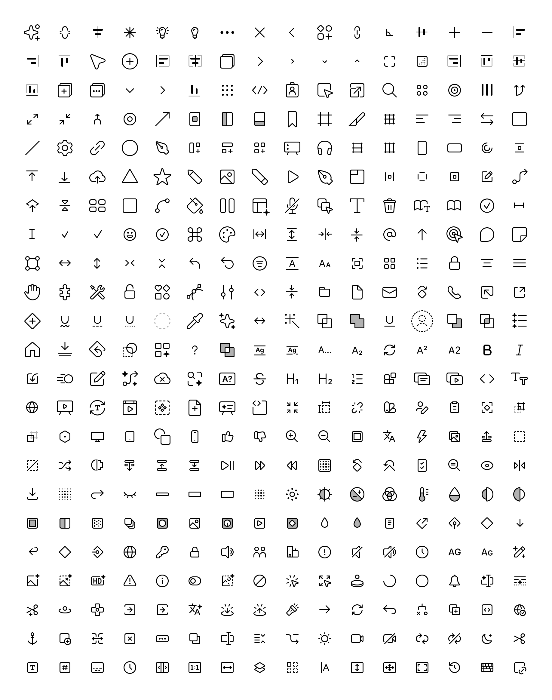

- Polished, cleaned up, and optimized UI3 icons. 
- Built using base shapes sourced from the UI3 file provided by Figma.


### Usage

```bash
npm install @ui3/icons  // For optimized SVGs
OR
npm install @ui3/react  // For React components
OR
npm install @ui3/vue    // For Vue components
```